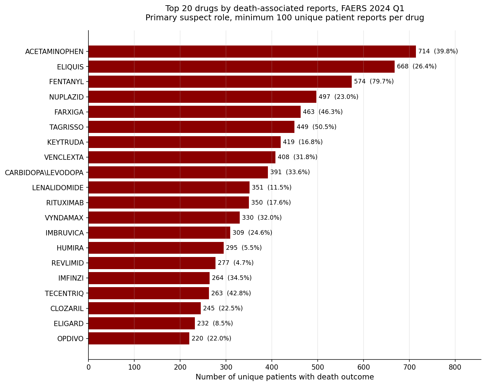

# OncoSignal

A pharmacovigilance data engineering and signal detection project built on FDA FAERS (FDA Adverse Event Reporting System) data.

OncoSignal processes raw FAERS quarterly archives into a structured analytical dataset and runs pharmacovigilance analyses on top of it. The long-term aim is signal detection for adverse drug reactions, with a particular interest in oncology drugs.

This is an active learning project. Not all components listed in the roadmap are complete. Status is documented honestly below.

## Project status

**Phase A (Data engineering) — Complete**

- Quarterly FAERS archive downloader from the FDA public export server
- Loader for all 7 FAERS data tables (DEMO, DRUG, REAC, OUTC, INDI, THER, RPSR)
- Relational join layer producing a single analytical dataset of drug-reaction pairs with patient demographics and outcome flags attached
- Persistence layer using Apache Parquet with Snappy compression

**Phase B (Descriptive analysis) — In progress**

- Drug-death association ranking, filtered to primary suspect drugs (complete for 2024 Q1)
- Multi-quarter aggregation (pending)

**Phase C (Signal detection) — Planned**

- Disproportionality measures: Proportional Reporting Ratio (PRR) and Reporting Odds Ratio (ROR)
- Drug name normalisation to consolidate brand and generic name variants
- Visualisation layer for signal trends over time

**Phase D (Advanced methods) — Planned, not started**

- Bayesian Information Component (IC) for signal detection
- Reaction term clustering (BERTopic or similar)
- Supervised classifiers for signal prioritisation

## Current results

For 2024 Q1, the joined analytical dataset contains:

- 22,052,096 drug-reaction pair rows
- 406,184 unique patients
- 26,850 unique drug name strings (pre-normalisation)
- 12,361 unique reaction terms (MedDRA preferred terms)

The first descriptive analysis ranked the top 20 primary-suspect drugs by death-associated reports. The output is dominated by oncology drugs and end-of-life medications, which illustrates the core limitation of raw frequency analysis in pharmacovigilance: confounding by indication. Drugs given to seriously ill patients appear at the top of death rankings regardless of actual safety profile. This motivates the Phase C work on disproportionality measures.

Output file: `reports/drug_death_top_primary_suspect_2024q1.csv`

## Repository structure